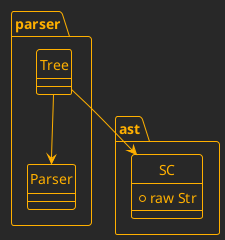

# SC DSL

## Grammar

```pest
sc  = { SOI ~ ASCII_ALPHA_LOWER ~ EOI }
```

## AST


```puml
@startuml
!theme crt-amber

hide circle

package ast {
    class SC {
        +raw Str
    }
}

package parser {
    class Parser
    class Tree
}

parser.Tree --> ast.SC
parser.Tree --> parser.Parser

@enduml
```
