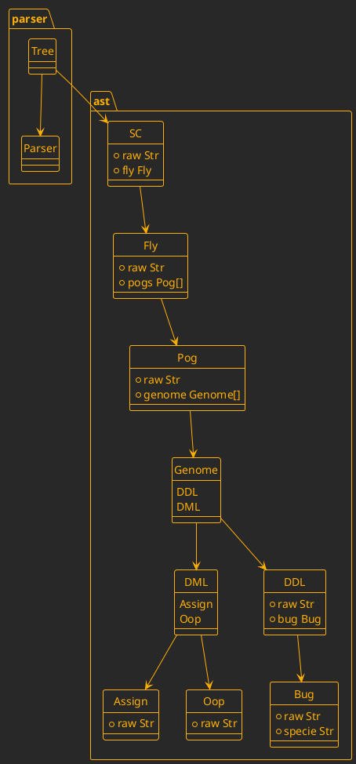

# SC DSL

## Grammar

```pest
sc     = { SOI ~ fly ~ EOI }
fly    = { (pog ~ nl)+ }
pog    = { genome+ }
genome = { ddl | dml }

ddl = { bug }
dml = { assign | oop }

bug  = { "bug" ~ s ~ specie ~ nl ~ gene* }
gene = { s ~ "gene" ~ s ~ tag ~ s ~ specie ~ NEWLINE* }

assign = { tag ~ s ~ "=" ~ s ~ oop }

oop      = { emitter ~ trail* }
emitter  = { specie | tag | literal }
trail    = { catalysis | carrier }

catalysis = { "." ~ tag ~ carrier? }
carrier   = { "(" ~ s ~ (binds | sequence)? ~ s ~ ")" }

binds    = { bind ~ (s ~ "," ~ s ~ bind)* }
sequence = { oop ~ (s ~ "," ~ s ~ oop)* }
bind     = { tag ~ s ~ ":" ~ s ~ oop }

literal = _{ bit | hex | decimal | int | str }
bit     = @{ "0b" ~ ASCII_BIN_DIGIT+ }
hex     = @{ "0x" ~ ASCII_HEX_DIGIT+ }
int     = @{ "-"? ~ ASCII_DIGIT+ }
str     = @{ "\"" ~ (!("\"") ~ ANY)* ~ "\"" }
decimal = @{ "-"? ~ ASCII_DIGIT+ ~ "." ~ ASCII_DIGIT+ }

tag    = { ASCII_ALPHA_LOWER ~ (ASCII_ALPHANUMERIC | "_")* }
specie = { ASCII_ALPHA_UPPER ~ (ASCII_ALPHANUMERIC)+ }

nl = _{ NEWLINE* }
s  = _{ (" " | "\t" | "\n" )* }

```

## AST


